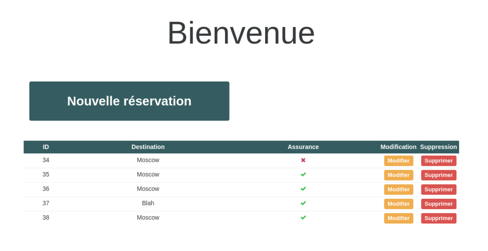
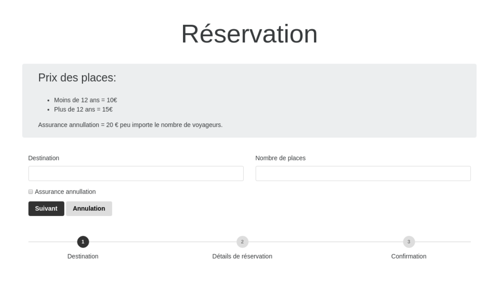
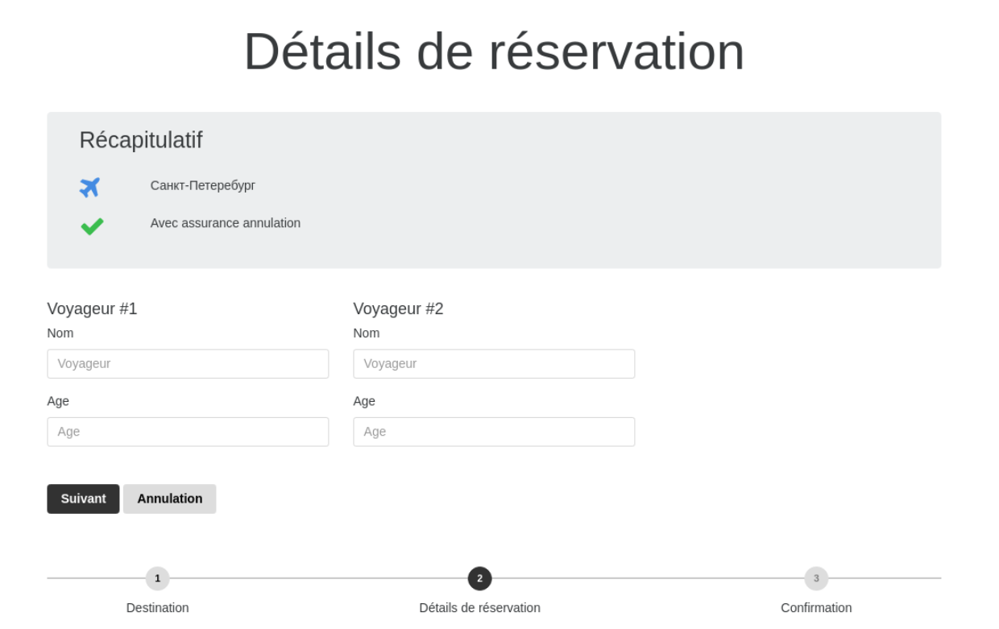
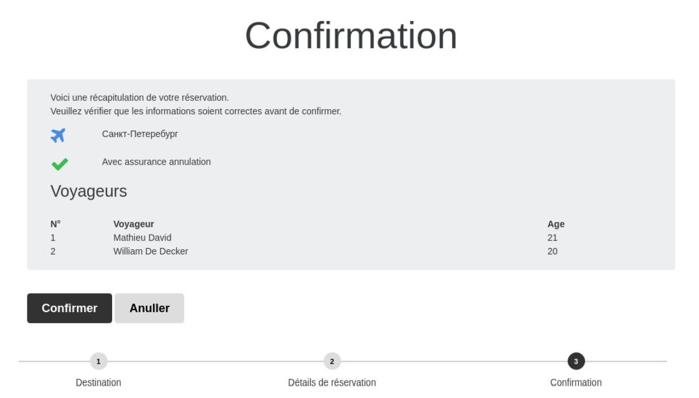
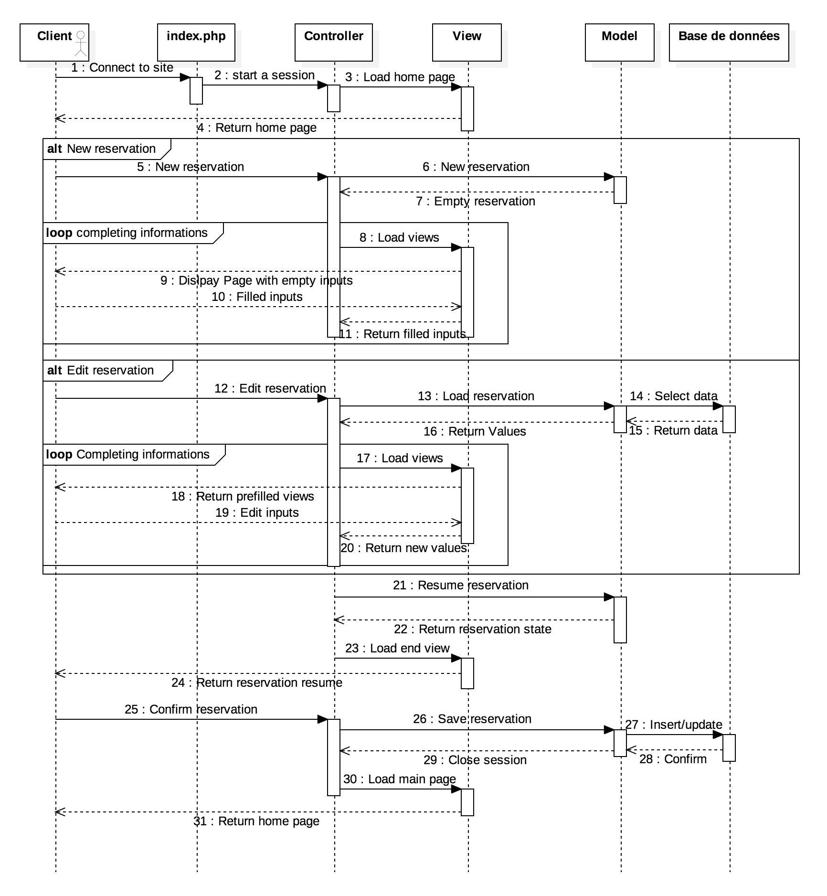

# Technologies Web: *Application PHP*

## Introduction

*Ici on introduit notre projet en disant ce que ça fait. On met les screenshot du fonctionnement normal du programme. On ne détaille pas le fonctionnement interne, uniquement ce que l'utilisateur verrait.*

Notre application de réservation en ligne a été pensée et structurée de la façon la plus agréable et simple d'utilisation possible selon nous. Faisons le tour des différentes pages afin d'en expliquer l'utilisation.



La première page comporte plusieurs éléments.
Tout d'abord intéressons nous au bouton **"Nouvelle réservation"**. Ce dernier comme son nom l'indique permet de créer une réservation et va donc rediriger vers une autre page où différentes informations seront demandées.

Nous avons ensuite un tableau où l'ensemble des réservations déjà effectuées précédement sont récapitulées. Chaque ligne de ce tableau indique la destination choisie, le numéros de la réservation, si une assurance annulationa été souscrite, un bouton de modification et un de suppression. Le premier renverra vers les mêmes pages que pour une nouvelle réservation, à l'exception qu'elles seront préremplies avec les valeurs propres à la réservation désirée. Le bouton de suppression, lui, supprimera de façon définitive la réservation (attention les passagers de cette réservation resteront eux en mémoire dans la base de données).

Les pages dont l'explication suit ne seront visible que si le bouton "nouvelle réservation" ou un des boutons "modifier" a été enfoncé.



Dans le seconde page, trois champs demandent à être complété. Premièrement un nom de destination doit être saisi. Pour le moment toutes les destinations existe, une possibilité d'amélioration serait de restreindre le choix de l'utilisateur à une liste de destinations proposées.
Nous voyons ensuite un champs "assurance annulation". Ce champs va permettre de pouvoir annuler un voyage sans frais. Cette assurance n'est pas par défaut, il faut donc cocher la case pour la demander.
Il suffit ensuite d'indiquer le nombre de personnes participant au voyage et de passer à l'étape suivante en cliquant sur "suivant".




La troisième page sert à récolter les informations (nom et âge) propre à chaque passageur. Il faut là entrer les informations demandées et cliquer sur "suivant".



La dernière page est un récapitulatif de l'ensemble de la réservation. Il devrait apparaitre sur cette page la destination avec/sans assurance et l'ensemble des passagers ainsi que leurs données propores. Pour valider la réservation cliquer sur "confirmer", vous serez ensuite automatiquement rediriger vers la page d'accueil où devrait maintenant apparaitre dans le tableau récapitulatif la réservation qui vient d'être réalisée.


## Structure du projet
La structure de notre code reflète bien le **pattern MVC** que nous avons utilisé pour ce projet, comme demandé dans l'énoncé. Nous pouvons retrouver un **controleur**, plusieures **vues** et deux **modèles** dans notre projet.
```
.
├── index.php
├── controllers
│   └── app.php
├── css
│   └── style.css
├── LICENSE
├── models
│   ├── passenger.php
│   └── reservation.php
└── views
    ├── partials
    │   ├── footer.php
    │   └── header.php
    ├── reservation-form-0.php
    ├── reservation-form-1.php
    ├── reservation-form-2.php
    └── reservation-form-validated.php
```

Toutes les requêtes sont faites vers le fichier `index.php`, qui va démarrer la session et lancer le controlleur pour qu'il gère la requête.

Le controleur, situé dans `controllers/app.php` est une classe contenant une seule methode d'instance publique: `handle()`. Cette méthode va vérifier la présence, ou non, de certains paramètres envoyé avec la requête pour la dispatcher à une des méthodes internes qui s'occupera de faire les validations nécéssaires et d'afficher la page adéquate.

Il est intéréssent de noter que quand on affiche une des pages du formulaire, nous vérifions si les données ne sont pas déjà inscrite dans la session à l'aide de ce petit bout de code:

```php
<?php
if (isset($_SESSION['trip'])) {
    $trip = unserialize($_SESSION['trip']);
} else {
    $trip = null;
}
?>
```


## Diagramme de séquence





##Conclusion


*a dire : pas d interface admin, pas assez de commentaire, pas de calcul du prix du voyage, et sécurité pas optimal /*


Plusieurs choses pourraient être le sujet de modification et de dévellopement. Les raisons pour lesquelles nous n'avons pas fait ces modifications est simple, manque de temps et consigne par vague. Nous avons en effet reçu en deux semaines un très grand nombre de projet à rendre en un labs de temps assez cours. Difficile donc de pousser chaque projet jusqu'au bout, nous avons préféré rendre plusieurs bons projets plutôt que un excellent et plusieurs médiocres. La seconde raison est que ce site web a été construit pas à pas avec des objectis finaux qui n'était pas tout à fait dans la même optique. Nous avons en effet du modifier un projet existant (faisant le sujet du travail précédent) pour ce site, et le modifier pour qu'il fasse l'affaire. La bonne solution qu'il aurait fallu faire aurait été de tout recommencer à zéro en s'inspirant du travail déjà fourni et non le modifier. Bien sûr celà aurait demandé un temps et des efforts supplémentaires que nous n'avions pas le luxe d'avoir.

Nous mettons donc en avant par ce projet qu'il faut toujours bien déterminé les attentes envers le produit final avant de commencer sa conception et se limiter à ce qui avait été décidé sans changer en cours de route d'avis sur ce que le résultat final doit faire.


## Code
##### index.php
```php
<?php
    session_start();
    include_once 'controllers/app.php';
    $app = new App();
    $app->handle();
```

##### controllers/app.php
```php
<?php

class App
{
    public function handle()
    {
        include_once 'models/reservation.php';
        include_once 'models/passenger.php';
        if (isset($_POST['new'])) {
            $this->new();
        } /*elseif (isset($_POST['old'])) {
            $this->old();
        } */elseif (isset($_POST['step_1'])) {
            $this->step_1();
        } elseif (isset($_POST['step_2'], $_SESSION['trip'])) {
            $this->step_2();
        } elseif (isset($_POST['destroy']) || isset($_POST['destroy_2'])) {
            $this->cancel();
        } elseif (isset($_POST['add'])) {
            $this->update_P();
        } elseif (isset($_POST['delete'])) {
            $this->delete_P();
        } elseif (isset($_POST['Done'])) {
            session_destroy();
            $this->home();
        } elseif (isset($_POST['Update'])) {
            $this->update();
        } elseif (isset($_POST['remove'])) {
            $id = $_POST['remove'];
            Reservation::remove($id);
            $this->home();
        } elseif (isset($_POST['edit'])) {
            $id = $_POST['edit'];
            $this->load_reservation_to_session($id);
            $this->new();
        } else {
            $this->home();
        }
    }
    private function update_P()
    {
        $trip = unserialize($_SESSION['trip']);

        $traveller = $_POST['traveller'];
        $age = $_POST['age'];
        $reserv_ID = $trip->get_id_travel();
        $trip->save_Passenger($traveller, $age, $reserv_ID);
        $this->old();
        $_SESSION['trip'] = serialize($trip);
    }
    private function update()
    {
        $trip = unserialize($_SESSION['trip']);

        $new_dest = $_POST['modif'];
        $trip->set_destination($new_dest);
        $trip->edit();
        $this->old();
    }
    private function delete_P()
    {
        $trip = unserialize($_SESSION['trip']);
        $id = $_POST['Delete_P'];
        $trip->del_Passenger($id);
        $this->old();
        $_SESSION['trip'] = serialize($trip);
    }

    private function home()
    {
        include 'views/reservation-form-0.php';
    }
    private function new()
    {
        if (isset($_SESSION['trip'])) {
            $trip = unserialize($_SESSION['trip']);
        } else {
            $trip = null;
        }

        include 'views/reservation-form-1.php';
    }

    private function load_reservation_to_session($id)
    {
        $trip = Reservation::get($id);
        $_SESSION['trip'] = serialize($trip);
    }

    private function step_1()
    {
        if (empty($_POST['destination'])) {
            //raise error
          ?>
          <script >
              alert('Veuillez indiquer une destination.');
          </script>

          <?php
          $this->new();
        } elseif (empty($_POST['places'])) {
            //raise error
          ?>
            <script >
              alert('Minimum un voyageur requis.');
            </script >

          <?php
          $this->new();
        } elseif ($_POST['places'] <= 0) {
            //raise error
          ?>
            <script>
              alert('Veuillez entrez un nombre positifs de voyageurs. ');
            </script>
          <?php
          $this->new();
        } else {
            if (isset($_SESSION['trip'])) {
                $trip = unserialize($_SESSION['trip']);
            } else {
                $trip = new Reservation();
            }

            $target = $_POST['destination'];
            $places = filter_var($_POST['places'], FILTER_VALIDATE_INT);
            $insurance = isset($_POST['insurance']) ? (bool) $_POST['insurance'] : false;

            $trip->set_destination($target);
            $trip->set_n_passengers($places);
            $trip->set_cancellation_insurance($insurance);
            $euromut = $trip->case_insurance();

            $_SESSION['trip'] = serialize($trip);

            include 'views/reservation-form-2.php';
        }
    }

    private function step_2()
    {
        $travellers = $_POST['traveller'];
        $ages = $_POST['age'];
        $trip = unserialize($_SESSION['trip']);
        $trip->erase_passengers_DB();
        unset($trip->passengers);
        foreach ($travellers as $i => $traveller) {
            //location of duplication of passengers !! being created twice
            $trip->add_passenger(new passenger($traveller, $ages[$i]));
            $age = $ages[$i];
        }
        $id_travel = $trip->get_id_travel();
        $destination = $trip->show_dest();
        $insurance_Bool = $trip->has_insurance();
        $insurance_T = $trip->case_insurance();
        $passengers = $trip->get_passengers();
        $_SESSION['trip'] = serialize($trip);
        //save() sets all the detail of the reservation into our database 'avengers'
        $trip->save();
        /* As the id of the reservation is set in to save() routine, get_id_travel() needs
        to be called after save(). */
        $id_travel = $trip->get_id_travel();

        include 'views/reservation-form-validated.php';
    }

    private function cancel()
    {
        session_destroy();
        $this->home();
    }
}
```

##### models/reservation.php
```php
<?php

include_once 'passenger.php';

class Reservation
{
    private $id;
    private $destination;
    private $n_passengers = 0;
    private $cancellation_insurance = false;
    public $passengers = array();
    //private $id_travel = 0;
    private $mysqli;

    public function __construct(string $dest = null, bool $insurance = null, int $id = null)
    {
        if ($id != null) {
            $this->id = $id;
        }

        $this->destination = $dest;
        $this->cancellation_insurance = $insurance;
    }

    public function set_destination(string $dest)
    {
        $this->destination = $dest;
    }
    public function set_id_travel($value)
    {
        $this->id = $value;
    }

    public function get_destination()
    {
        return $this->destination;
    }

    public function set_n_passengers(int $n)
    {
        if (is_null($n)) {
            throw new Exception('Number of passengers is null');
        }
        $this->n_passengers = $n;
    }

    public function get_n_passengers()
    {
        return $this->n_passengers;
    }

    public function set_cancellation_insurance(bool $insurance)
    {
        if (is_bool($insurance)) {
            $this->cancellation_insurance = $insurance;
        } else {
            throw new Exception('Expected a boolean!');
        }
    }

    public function has_insurance()
    {
        return $this->cancellation_insurance;
    }

    public function add_passenger(Passenger $passenger)
    {
        $this->passengers[] = $passenger;
        if (count($this->passengers) > $this->n_passengers) {
            $this->n_passengers = count($this->passengers);
        }
    }

    public function complete()
    {
        return false;
    }
    public function get_passengers()
    {
        return $this->passengers;
    }
    public function show_dest()
    {
        return $this->destination;
    }
    public function case_insurance()
    {
        if ($this->cancellation_insurance == true) {
            return 'avec';
        } else {
            return 'sans';
        }
    }
    public function insurance_to_string($case)
    {
        if ($case == 1) {
            return 'avec';
        } else {
            return 'sans';
        }
    }
    public function get_id_travel()
    {
        return $this->id;
    }

    public function load_data($id)
    {
        $this->mysqli = new mysqli('localhost', 'user', 'password', 'avengers') or die('Could not select database');

        if ($this->mysqli->connect_errno) {
            echo 'Echec lors de la connexion à MySQLi : ('.$this->mysqli->connect_errno.') '.$this->mysqli->connect_error;
        }
        $load_Reserv = "SELECT * FROM avengers.avengers WHERE id ='$id'";

        $resultR = $this->mysqli->query($load_Reserv);

        $array = $resultR->fetch_array(MYSQLI_ASSOC);

        return $array;
    }

    public function load_people($id)
    {
        $this->mysqli = new mysqli('localhost', 'user', 'password', 'avengers') or die('Could not select database');

        if ($this->mysqli->connect_errno) {
            echo 'Echec lors de la connexion à MySQLi : ('.$this->mysqli->connect_errno.') '.$this->mysqli->connect_error;
        }

        // FIXME: NOT GOOD --> SQL INJECTION RISK...
        $load_People = "SELECT * FROM avengers.peoples WHERE voyage =$id";
        $resultP = $this->mysqli->query($load_People);
        $posts = array();

        while ($row = $resultP->fetch_array()) {
            $ID = $row['id'];
            $name = $row['name'];
            $age = $row['age'];
            $voyage = $row['voyage'];

            $posts [] = array(
               'ID' => $ID,
               'name' => $name,
               'age' => $age,
               'voyage' => $voyage,
              );
        }

        return $posts;
    }

    public function save()
    {
        $this->mysqli = new mysqli('localhost', 'user', 'password', 'avengers') or die('Could not select database');

        if ($this->mysqli->connect_errno) {
            echo 'Echec lors de la connexion à MySQLi : ('.$this->mysqli->connect_errno.') '.$this->mysqli->connect_error;
        }

        if ($this->id == null) {
            $sqlReserv = "INSERT INTO avengers.avengers(endroit, Cancel_Insurance)
        VALUES('$this->destination','$this->cancellation_insurance')";
            if ($this->mysqli->query($sqlReserv) == true) {
                //  echo 'Record updated successfully';
            $id_insert = $this->mysqli->insert_id;
                $this->id = $id_insert;
            } else {
                echo 'Error inserting record: '.$this->mysqli->error;
            }
        } else {

            //UPDATE `peoples` SET `name` = 'Mathieux', `age` = '23' WHERE `peoples`.`id` = 86;
            $query = $this->mysqli->prepare('UPDATE avengers SET endroit = ?, Cancel_Insurance = ? WHERE avengers.id = ?');
            $query->bind_param('sii', $this->destination, $this->cancellation_insurance, $this->id);

            if ($query->execute() == false) {
                echo 'Error inserting record: '.$this->mysqli->error;
            }

            $query->close();
        }

        foreach ($this->passengers as $i => $passenger) {
            //var_dump($passenger->return_id());
            if ($passenger->id == null) {
                var_dump($this->passengers);
                echo '<br>';
                $sqlPerson = "INSERT INTO avengers.peoples(name, age, voyage)
                VALUES('$passenger->name','$passenger->age','$this->id')";
                if ($this->mysqli->query($sqlPerson) == true) {
                    //echo 'Record updated successfully';
                } else {
                    echo 'Error inserting record: '.$this->mysqli->error;
                }
            } else {
                echo 'Updating'.$passenger->return_id();
                $p_id = $passenger->return_id();
                var_dump($p_id);
                //UPDATE `peoples` SET `name` = 'Mathieux', `age` = '23' WHERE `peoples`.`id` = 86;
                $query = $this->mysqli->prepare('UPDATE peoples SET name = ?, age = ? WHERE voyage = ?');
                $query->bind_param('sii', $passenger->name, $passenger->age, $this->id);

                if ($query->execute() == false) {
                    echo 'Error inserting record: '.$this->mysqli->error;
                }

                $query->close();
            }
        }
    }

    public static function list_reservations()
    {
        $mysqli = new mysqli('localhost', 'user', 'password', 'avengers') or die('Could not select database');

        $query = $mysqli->prepare('SELECT * FROM avengers');
        $query->execute();
        $query->bind_result($id, $destination, $insurance);

        $reservations = array();

        while ($query->fetch()) {
            $reservations[] = ['id' => $id, 'destination' => $destination, 'insurance' => $insurance];
        }

        $query->close();

        return $reservations;
    }

    public static function remove($id)
    {
        $mysqli = new mysqli('localhost', 'user', 'password', 'avengers') or die('Could not select database');

        $query = $mysqli->prepare('DELETE FROM avengers WHERE id = ?');
        $query->bind_param('i', $id);
        $query->execute();
        $query->close();
    }
    public function erase_passengers_DB()
    {
        $mysqli = new mysqli('localhost', 'user', 'password', 'avengers') or die('Could not select database');
        foreach ($this->passengers as $i => $passenger) {
            $query = $mysqli->prepare('DELETE FROM avengers.peoples where voyage = ?');
            $query->bind_param('i', $this->id);
            $query->execute();
            $query->close();
        }
    }
    public static function get($trip_id)
    {
        $mysqli = new mysqli('localhost', 'user', 'password', 'avengers') or die('Could not select database');

        $query = $mysqli->prepare('SELECT * FROM avengers WHERE id = ?');
        $query->bind_param('i', $trip_id);
        $query->execute();
        $query->bind_result($id, $destination, $insurance);
        $query->fetch();
        $query->close();

        $reservation = new self($destination, $insurance, $id);

        $query = $mysqli->prepare('SELECT * FROM peoples WHERE voyage = ?');
        $query->bind_param('i', $trip_id);
        $query->execute();
        $query->bind_result($id, $name, $age, $reserv_id);

        while ($query->fetch()) {
            $passenger = new Passenger($name, $age, $id);
            $reservation->add_passenger($passenger);
        }

        $query->close();

        return $reservation;
    }
}
```

##### models/passenger.php
```php
<?php

class Passenger
{
    public $name;
    public $age;
    public $id = null;

    public function __construct($name, $age, $id = null)
    {
        $this->name = $name;
        $this->age = $age;
        if ($id != null) {
            $this->id = $id;
        }
    }

    public function return_id()
    {
        return $this->id;
    }
}
```

##### views/partials/header.php
```php
<!DOCTYPE html>
<html>
    <head>
        <meta charset="utf-8">
        <title>Réservation</title>

        <!-- Load bootstrap 4 stylesheets and dependencies -->
        <link rel="stylesheet" href="node_modules/bootstrap/dist/css/bootstrap.min.css">
        <link rel="stylesheet" href="node_modules/tether/dist/css/tether.min.css">
        <link rel="stylesheet" href="node_modules/font-awesome/css/font-awesome.min.css">

        <link rel="stylesheet" href="css/style.css">

        <script src="node_modules/jquery/dist/jquery.min.js" charset="utf-8"></script>
    </head>
    <body>
      <div class="container">
```

##### views/partials/footer.php
```php
</div>

  <script src="node_modules/tether/dist/js/tether.min.js" charset="utf-8"></script>
  <script src="node_modules/bootstrap/dist/js/bootstrap.min.js" charset="utf-8"></script>
</body>

</html>
```

##### views/reservation-form-0.php
```php
<?php
    // Include the header file that contains
    // - the opening html tags
    // - <head> tags with the necessary style and javascript includes
    // - opening body tag and a bootstrap "container" div
    include 'partials/header.php';
?>


<div id="index-page">
    <h1 class="row">Bienvenue</h1>

    <div class="row">
        <div class="col-md-6">
            <form method="post" action="index.php" class="container">
                <button id="new-reservation" type="submit" class="btn btn-primary big" name="new">
                    Nouvelle réservation
                </button>
            </form>
        </div>

        <div class="col-md-6">
            <form method="post" action="index.php" class="container">
                <button id="old-reservations" type="submit" class="btn btn-primary big" name="old">
                    Accéder à une réservation
                </button>
            </form>
        </div>
    </div>


    <table class="table table-sm">
        <thead>
            <tr>
                <th class="text-xs-center">ID</th>
                <th class="text-xs-center">Destination</th>
                <th class="text-xs-center">Assurance</th>
                <th class="text-xs-center">Modification</th>
                <th class="text-xs-center">Suppression</th>
            </tr>
        </thead>
        <tbody>
        <?php
            $reservations = Reservation::list_reservations();

            foreach ($reservations as $res) {
                echo '<tr>';
                echo '<td class="text-xs-center">'.$res['id'].'</td>';
                echo '<td class="text-xs-center">'.$res['destination'].'</td>';

                if ($res['insurance']) {
                    echo '<td class="text-xs-center">
                        <i class="fa fa-check"></i>
                    </td>';
                } else {
                    echo '<td class="text-xs-center">
                        <i class="fa fa-times"></i>
                    </td>';
                }

                echo '<td class="text-xs-center edit">
                        <form method="post" action="index.php">
                            <button type="submit" class="btn btn-warning btn-sm" name="edit" value="'.$res['id'].'">Modifier</button>
                        </form>
                      </td>';

                echo '<td class="text-xs-center delete">
                        <form method="post" action="index.php">
                            <button type="submit" class="btn btn-danger btn-sm" name="remove" value="'.$res['id'].'">Supprimer</button>
                        </form>
                      </td>';
                echo '</tr>';
            }
        ?>
        </tbody>

    </table>

</div>


<?php
    // Include the footer file that contains
    // - javascript includes
    // - all closing tags corresponding to the opening tags in the header
    include 'partials/footer.php';
?>
```

##### views/reservation-form-1.php
```php
<?php
    // Include the header file that contains
    // - the opening html tags
    // - <head> tags with the necessary style and javascript includes
    // - opening body tag and a bootstrap "container" div
    include 'partials/header.php';
?>

<div id="step-1">

    <h1 class="row">Réservation</h1>

    <div class="row">

        <div class="jumbotron">
            <h3>Prix des places:</h3>
            <ul>
                <li>Moins de 12 ans = 10€</li>
                <li>Plus de 12 ans = 15€</li>
            </ul>
            Assurance annullation = 20 € peu importe le nombre de voyageurs.
        </div>
    </div>

    <form method="post" action="index.php">

        <div class="row">
            <div class="form-group col-md-6">
                <label for="destination">Destination</label>
                <input type="text" id="destination" name="destination"  class="form-control"
                <?php
                   if ($trip != null) {
                       echo 'value="'.$trip->get_destination().'"';
                   }?>/>
            </div>

            <div class="form-group col-md-6">
                <label for="places">Nombre de places</label>
                <input type="number" min="1" id="places" name="places" class="form-control"
                <?php if ($trip != null) {
                       echo 'value="'.$trip->get_n_passengers().'"';
                   }?>/>
            </div>
        </div>


        <div class="form-check">
            <label class="form-check-label">
                <input type="checkbox" id="insurance" name="insurance" value="valeur" class="form-check-input" <?php if ($trip != null) {
                       echo 'checked='.$trip->has_insurance();
                   }?> />
                Assurance annullation
            </label>
        </div>


        <button type="submit" class="btn btn-primary" name="step_1">Suivant</button>
        <button name="destroy" class="btn btn-default">Annulation</button>


    </form>

    <div class="stepwizard">
        <div class="stepwizard-row">
            <div class="stepwizard-step">
                <button type="button" class="btn btn-primary btn-circle">1</button>
                <p>Destination</p>
            </div>
            <div class="stepwizard-step">
                <button type="button" class="btn btn-default btn-circle" disabled="disabled">2</button>
                <p>Détails de réservation</p>
            </div>
            <div class="stepwizard-step">
                <button type="button" class="btn btn-default btn-circle" disabled="disabled">3</button>
                <p>Confirmation</p>
            </div>
        </div>
    </div>


</div>

<?php
    // Include the footer file that contains
    // - javascript includes
    // - all closing tags corresponding to the opening tags in the header
    include 'partials/footer.php';
?>
```

##### views/reservation-form-2.php
```php
<?php
  include 'partials/header.php';
 ?>

<div id="step-2">

      <h1 class="row">Détails de réservation</h1>

      <div class="jumbotron container">
          <h3>Récapitulatif</h3>
          <p class="row">
              <i class="fa fa-plane fa-2x col-md-1"></i>
              <span class="destination col-md-11">
                  <?php echo $trip->get_destination(); ?>
              </span>
          </p>
          <p class="row">
              <?php if ($trip->has_insurance()) {
     ?>
              <i class="fa fa-check fa-2x col-md-1"></i>
              <span class="destination col-md-11">
                  Avec assurance annulation
              </span>
              <?php

 } else {
     ?>
              <i class="fa fa-times fa-2x col-md-1"></i>
              <span class="destination col-md-11">
                  Sans assurance annulation
              </span>
              <?php

 }?>
          </p>
      </div>

      <form method="post" action="index.php">


          <div class="row">

          <?php
          //creating a dictionnary people
          $people = array(); //doesn't work
          for ($i = 0; $i < (int) $_POST['places']; ++$i) {
              ?>

              <div class="col-md-4 passenger">

                  <h5>Voyageur #<?php echo $i + 1; ?> </h4>
                  <div class="form-group">
                      <label for="traveller">Nom</label>
                      <input name="traveller[]" type="text" placeholder="Voyageur" class="form-control"
                      <?php
                        if (array_key_exists($i, $trip->passengers)) {
                            echo 'value="'.$trip->passengers[$i]->name.'"';
                        } ?>
                      />
                  </div>
                  <div class="form-group">
                      <label for="age">Age</label>
                      <input name="age[]" type="text" placeholder="Age" class="form-control"
                      <?php  if (array_key_exists($i, $trip->passengers)) {
                            echo 'value="'.$trip->passengers[$i]->age.'"';
                        } ?>/>
                  </div>
              </div>
              <?php

          } ?>
          </div>

          <div class="row">
              <div class="form-group col-md-12">
                  <button name="step_2" class="btn btn-primary" name = "Submit">Suivant</button>
                  <button name="destroy_2" class="btn btn-default">Annulation</button>
              </div>
          </div>
      </form>

      <div class="stepwizard">
          <div class="stepwizard-row">
              <div class="stepwizard-step">
                  <button type="button" class="btn btn-default btn-circle">1</button>
                  <p>Destination</p>
              </div>
              <div class="stepwizard-step">
                  <button type="button" class="btn btn-primary btn-circle">2</button>
                  <p>Détails de réservation</p>
              </div>
              <div class="stepwizard-step">
                  <button type="button" class="btn btn-default btn-circle" disabled="disabled">3</button>
                  <p>Confirmation</p>
              </div>
          </div>
      </div>

</div>

  <?php
  include 'partials/footer.php';
  ?>
```

##### views/reservation-form-validated.php
```php
<?php
    // Include the header file that contains
    // - the opening html tags
    // - <head> tags with the necessary style and javascript includes
    // - opening body tag and a bootstrap "container" div
    include 'partials/header.php';
?>

<div id="step-validation">

    <h1>Confirmation</h1>

    <div class="jumbotron">
        <p>
            Voici une récapitulation de vôtre réservation.<br>
            Veuillez vérifier que les informations soient correctes avant de confirmer.
        <p>

        <p class="row">
            <i class="fa fa-plane fa-2x col-md-1"></i>
            <span class="destination col-md-11">
                <?php echo $trip->get_destination(); ?>
            </span>
        </p>

        <p class="row">
            <?php if ($trip->has_insurance()) {
    ?>
            <i class="fa fa-check fa-2x col-md-1"></i>
            <span class="destination col-md-11">
                Avec assurance annulation
            </span>
            <?php

} else {
    ?>
            <i class="fa fa-times fa-2x col-md-1"></i>
            <span class="destination col-md-11">
                Sans assurance annulation
            </span>
            <?php

}?>
        </p>

        <h3>Voyageurs</h3>
        <table>
            <tr>
                <th>N°</th>
                <th>Voyageur</th>
                <th>Age</th>
            </tr>
            <?php foreach ($passengers as $i => $passenger) {
    ?>
                <tr>
                    <td><?php echo $i + 1; ?></td>
                    <td><?php echo $passenger->name; ?></td>
                    <td><?php echo $passenger->age; ?></td>
                </tr>
            <?php

} ?>
        </table>
    </div>

    <div class="row">
        <form method="post" action="index.php" class="col-md-12">
            <button name="destroy_3" class="btn btn-primary btn-lg">Confirmer</button>
            <button name="destroy_3" class="btn btn-default btn-lg">Anuller</button>
        </form>
    </div>

    <div class="stepwizard row">
        <div class="stepwizard-row">
            <div class="stepwizard-step">
                <button type="button" class="btn btn-default btn-circle">1</button>
                <p>Destination</p>
            </div>
            <div class="stepwizard-step">
                <button type="button" class="btn btn-default btn-circle">2</button>
                <p>Détails de réservation</p>
            </div>
            <div class="stepwizard-step">
                <button type="button" class="btn btn-primary btn-circle">3</button>
                <p>Confirmation</p>
            </div>
        </div>
    </div>

</div>

<?php
    // Include the footer file that contains
    // - javascript includes
    // - all closing tags corresponding to the opening tags in the header
    include 'partials/footer.php';
?>
```
